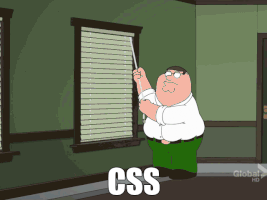

# Hi!👋 My name is Oleg 🧑‍💻 I am а self-taught Software Engineer!

<code>👨‍💻 Job: Java Developer</code>
<code>🌱 Grow as: T-Shape Backend Software engineer</code>
<code>🧑‍🎓 Education: Radio Engineer</code> 

<code>🤖 Languages:</code>
<code></code>
<code></code>
<code></code> 
<code>🚀 Technologies:</code> 
<code>💡 [Skills](SKILLS.md)</code>
<code>🗺️ [Knowledge map]()</code> 
<code>🛠️ [Projects: 1](PROJECTS.md)</code>
<code>🎓 [Certificates: 1](CERTIFICATION.md)</code>
<code>📚 [My readlist: 0](READED_BOOKS.md)</code> 
<code>Blogs:</code>
<code>🎙️ [Youtube](https://www.youtube.com/@ducknowledges)</code>
<code>📝 [Blog]()</code>
<code>✏️ [Written articles: 0](ARTICLES.md)</code> 
<code>Contacts:</code>
<code>📫 [ducknowledges@gmail.com](mailto:ducknowledges@gmail.com)</code>

## About me

- At some point in my life, I realized (installed linux🐧 and could not stop 😅) that I was interested in programming.

- self-taught front-end and had experience as a front-end developer 👨‍💻

- after I wanted to solve more complex problems to expand my expertise as software engineer, I decided to learn backend Java.

